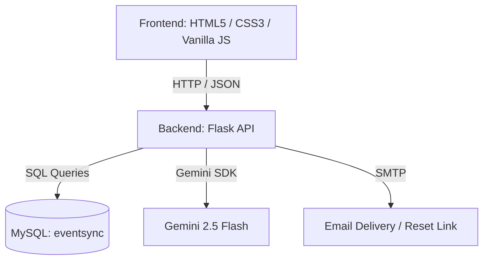
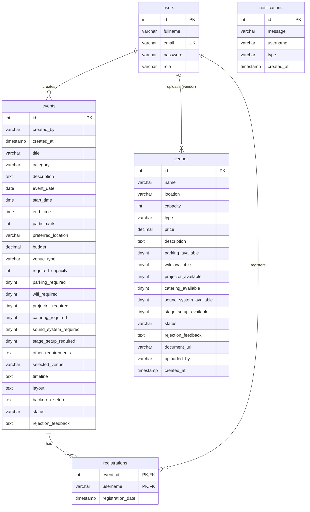

# EventSync Project Analysis

A comprehensive technical analysis of the **EventSync Event Management System** repository, which is a corporate event coordination, venue discovery, and interactive planning platform.

---

## 1. Project Overview & Architecture

**EventSync** is designed as a multi-role, centralized platform for managing corporate events. The project architecture follows a decoupled client-server pattern:



### Tech Stack
*   **Frontend**: Vanilla HTML5, CSS3 (organized per-page), and native JavaScript (ES6+). External libraries are loaded via CDN (e.g., `sweetalert2` for alerts, `marked.js` for markdown rendering).
*   **Backend**: Python Flask REST API utilizing `Flask-MySQLdb` for database connectivity, `Flask-Cors` for cross-origin requests, `python-dotenv` for configuration, and `gunicorn` for production deployment.
*   **Database**: MySQL database (`eventsync`).
*   **AI Integration**: Google Generative AI (`gemini-2.5-flash` model) utilized for an interactive planning chatbot.

---

## 2. Codebase Structure

The project has a clear folder structure separating responsibilities:

```
FYP_Event_Management_System/
├── backend/
│   ├── app.py                # Main Flask API containing routing & validation
│   ├── requirements.txt      # Python dependencies
│   └── chatbot.env           # Environment configuration (API keys, DB setup)
├── database/
│   ├── schema.sql            # Main database DDL scripts
│   └── venues_dataset.sql    # Venues mock data inserts
├── frontend/
│   ├── css/                  # Styling files matching page basenames
│   ├── js/                   # Native JS scripts matching page actions
│   ├── images/               # Local static assets & backdrops
│   ├── login.html            # Entry login page
│   ├── register.html         # User registration page
│   └── ...                   # Functional workspace HTML pages
└── auto-backup.bat           # Backup automation script
```

---

## 3. Database Schema Analysis

The database consists of relational tables mapping users, events, venues, notifications, and registrations.



> [!IMPORTANT]
> ### Critical Discrepancy: Missing DDL for `registrations`
> While the table `registrations` is heavily query-mapped and modified in `backend/app.py` (e.g., in `/register-event`, `/unregister-event`, `/registrations/<username>`, and `/event/<event_id>/attendees`), it is **completely missing** from the [schema.sql](file:///c:/Users/Vinnn/OneDrive%20-%20Sunway%20Education%20Group/FYP_Event_Management_System/database/schema.sql) file.
>
> Running the project on a fresh instance will crash during event registration, statistics calculations, or participant dashboards.
>
> **Recommended Table Fix DDL**:
> ```sql
> CREATE TABLE IF NOT EXISTS `registrations` (
>     `event_id` INT NOT NULL,
>     `username` VARCHAR(255) NOT NULL,
>     `registration_date` TIMESTAMP DEFAULT CURRENT_TIMESTAMP,
>     PRIMARY KEY (`event_id`, `username`),
>     FOREIGN KEY (`event_id`) REFERENCES `events`(`id`) ON DELETE CASCADE
> );
> ```

---

## 4. Key Functional Features

### A. Interactive Event Planner (`planner.html` / `planner.js`)
*   **Dynamic Timelines**: Provides event category-based pre-built templates (e.g., Conferences, Workshops, Corporate Dinners) and lets users customize times and activities. Timeline data is serialized as JSON string arrays inside the database's `timeline` column.
*   **Drag-and-Drop Layout Planner**: Organizers can layout event components (Booths, Registration Counters, Catering Areas, LED Screens, Networking Zones) on a canvas.

### B. 3D Ballroom Backdrop Visualizer (`vr-backdrop.html` / `vr-backdrop.js`)
*   Provides 3D spatial setup simulator:
    *   organizers choose standard Ballroom backgrounds (such as the EQ Grand Ballroom or Glass Greenhouse).
    *   Place backdrop panels and custom exhibition banners (e.g., Cloud Security Columns, Belmont Exhibition Stands).
    *   Perform real-time zoom/scale adjustments, opacity adjustments, and coordinate dragging.
    *   Visualizer state is fully saved to database `backdrop_setup` column as a JSON payload.

### C. Live AI Chatbot (`communication.js` -> `/ai-chat`)
*   Uses `gemini-2.5-flash` model configuration.
*   **Contextual Awareness**: Before generating responses, the endpoint queries the database to retrieve all events created by the logged-in user and injects this information into the Gemini system instructions as context:
    ```python
    system_instruction = f"""
    You are EventSync AI, a professional corporate event management assistant.
    ...
    If the user asks about their own events, use the following database context to answer:
    {events_context}
    """
    ```
*   Ensures concise, markdown-compliant responses under 150 words focused entirely on corporate event scheduling and venue guidelines.

### D. Client-Side Venue Recommender (`landing-recommend.js`)
*   Implements a matching score algorithm matching Location, Capacity, Venue Type, and keyword compatibility (mapping event categories to corresponding keywords like "summit", "forum" for Conferences).
*   Sorts results and renders high-compatibility recommendations.

---

## 5. Security & Technical Findings

During the analysis, several areas of improvement and minor vulnerabilities were identified:

1.  **Plaintext Reset Password Update**:
    *   In the registration and login paths, passwords are encrypted/verified via `generate_password_hash` and `check_password_hash` (`werkzeug.security`).
    *   However, in `/reset-password` (lines 902-904), the new password is save-updated as **plaintext**!
        ```python
        # Update user's password (plaintext to match local database logic)
        cursor.execute("UPDATE users SET password = %s WHERE email = %s", (new_password, email))
        ```
    *   *Impact*: Users resetting their passwords will have insecure plaintext credentials saved directly into the database, rendering hash comparisons invalid on their subsequent logins.

2.  **Hardcoded API Target Host**:
    *   All JS files in `frontend/js/` (e.g., [login.js](file:///c:/Users/Vinnn/OneDrive%20-%20Sunway%20Education%20Group/FYP_Event_Management_System/frontend/js/login.js#L10), [vr-backdrop.js](file:///c:/Users/Vinnn/OneDrive%20-%20Sunway%20Education%20Group/FYP_Event_Management_System/frontend/js/vr-backdrop.js#L3)) reference `"http://127.0.0.1:5000"`.
    *   *Impact*: If the API port changes or the project is deployed to a network, all frontend assets must be modified manually.

3.  **Local Storage Auth Guards**:
    *   The frontend handles access controls (e.g., blocking participants from loading the planner page) purely client-side:
        ```javascript
        if (!localStorage.getItem("username") || localStorage.getItem("role") === "Participant") {
            window.location.href = "login.html";
        }
        ```
    *   *Impact*: Vulnerable to role spoofing via client console overrides. The backend endpoints do not validate caller authentication tokens (JWT or Flask Sessions) on private resources.

---

## 6. Recommended Action Plan

To ensure the EventSync system is secure, stable, and ready for deployment:

*   [ ] **Apply Database DDL Fix**: Add the `registrations` table schema into `database/schema.sql` to avoid setup failures.
*   [ ] **Fix Reset Password Hashing**: Wrap the updated password inside `generate_password_hash` in the `/reset-password` Flask route.
*   [ ] **Centralize Configuration**: Define an API base URL dynamically in a shared config script (e.g., `config.js`) to support dynamic staging environments.
*   [ ] **Add Backend Authentication**: Implement token-based authentication (e.g., JWT) to guard sensitive API endpoints instead of relying solely on client-side role settings.
